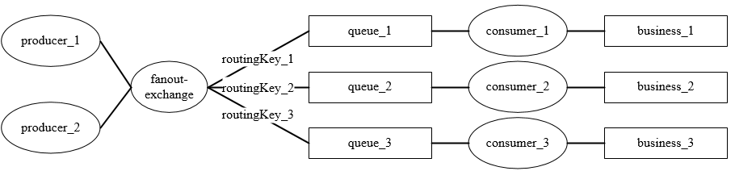
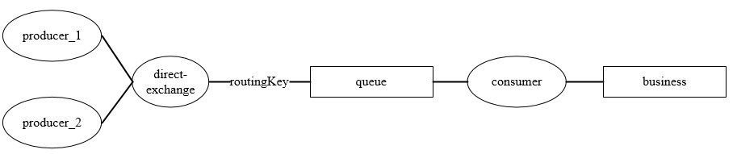
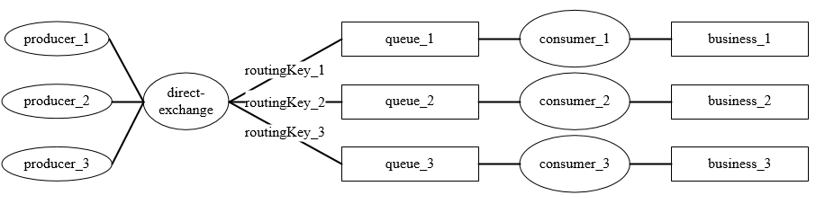
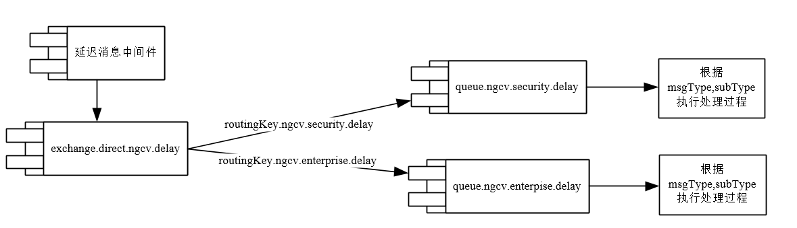
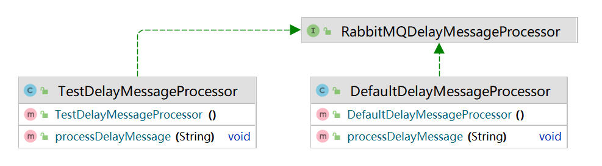
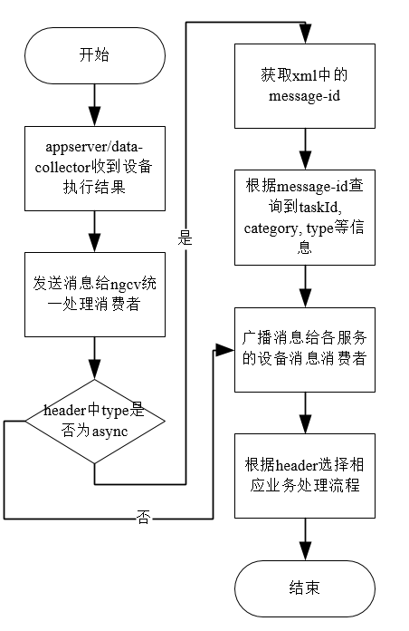
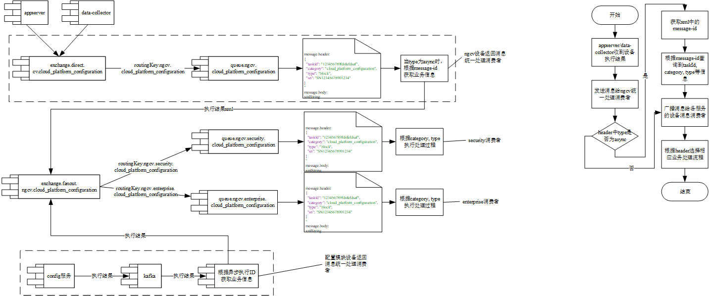

# 当前使用场景归纳

## exchange

### fanout

一个或多个生产者，一个exchange绑定多个queue，每个消费业务对应一个消费者、一个队列。

每个业务功能都会产生：

- 1个exchange；
- n个routingKey；
- n个queue；



1. 简单使用fanout exchange，绑定多个队列。

   1. `cv.exchange.device.reboot.exchange`。

      只在appserver中生产消息，`ngcv-security`多个业务消费者监听各自的队列消费消息。

2. 匿名队列绑定fanout exchange。

   1. `ngcv.exchange.enterprise.asset.update`。

      资产管理页面或自动识别更新资产，会生产资产变更信息，`ngcv-threat-dispatch`消费消息，更新内网识别内存。

### direct

一个或多个生产者，一个exchange绑定一个queue，每个消费业务对应一个消费者、一个队列。

每个业务功能都会产生：

- 1个exchange；
- 1个routingKey；
- 1个queue；




## queue

### 非匿名队列

非匿名队列的队列名称、属性都由用户自定义，一般默认：

- `durable = true`;
- `exclusive = false`;
- `autoDelete = false`;

### 匿名队列

- 和fanout exchange绑定；

- 自定义队列名称前缀，并获取base64命名后缀；

  ```java
  new AnonymousQueue(new Base64UrlNamingStrategy(DispatchConstant.DISPATCH_RELATIONSHIP_MODIFY_QUEUE));
  ```

# 命名规范

<table style="font-size:12px" width="100%">
    <caption>命名规范</caption>
    <tr>
        <th width="5%">组件</th>
        <th colspan="3" width="25%">命名规范</th>
        <th colspan="2" width="60%">格式推荐</th>
        <th colspan="2" width="10%">范例</th>
    </tr>
    <tr>
        <td rowspan="3">exchange</td>
        <td colspan="3" rowspan="3">只能包含字母、数字、短划线（-）、下划线（_）、半角句号（.）、井号（#）、正斜线（/）、at 符号（@），长度限制1~255 字符；</td>
        <td rowspan="3", colspan="2">{组件名称}.{组件特点}.{生产者项目名称}[.{生产者服务名称}].{业务名称}</td>
        <td>direct</td>
        <td>
            exchange.direct.cv.device_reboot<br/>
            业务名称可以适度通用：exchange.direct.ngcv.common
        </td>
    </tr>
    <tr>
        <td>fanout</td>
        <td>exchange.fanout.ngcv.enterprise.asset_update</td>
    </tr>
    <tr>
        <td>topic</td>
        <td>exchange.topic.cv.device_message</td>
    </tr>
    <tr>
        <td rowspan="2">queue</td>
        <td colspan="3" rowspan="2">只能包含字母、数字、短划线（-）、下划线（_）、半角句号（.）、井号（#）、正斜线（/）、at 符号（@），长度限制1~255 字符；</td>
        <td>普通队列</td>
        <td>{组件名称}[.{组件特点}].{消费者项目名称}[.{消费者服务名称}].{消费者业务名称}</td>
        <td colspan="2">
            queue.ngcv.security.reboot<br/>
            queue.auto-delete.ngcv.security.reboot
        </td>
    </tr>
    <tr>
        <td>匿名队列</td>
        <td>{组件名称}[.{组件特点}].{消费者项目名称}[.{消费者服务名称}].{消费者业务名称}.{系统生成后缀}</td>
        <td colspan="2">queue.anonymous.ngcv.security.reboot.sZZz07GDQnCTzWjEqQ5NNg</td>
    </tr>
    <tr>
        <td rowspan="2">routingKey</td>
        <td rowspan="2">长度限制1~255 字符；</td>
        <td>非topic类型</td>
        <td>只能包含字母、数字、短划线（-）、下划线（_）、半角句号（.）、正斜线（/）、at符号（@）</td>
        <td colspan="2">
            {组件名称}[.{组件特点}].{消费者项目名称}[.{消费者服务名称}].{消费者业务名称}<br/>
            （可与队列名后缀保持一致）
        </td>
        <td colspan="2">routingKey.ngcv.security.reboot</td>
    </tr>
    <tr>
        <td>topic类型</td>
        <td>
            <ul>
                <li>可以包含字母、数字、短划线（-）、下划线（_）、星号（*）、半角句号（.）、井号（#）、正斜线（/）、at符号（@）。</li>
                <li>不能以半角句号（.）开头或结尾。对于井号（#）或星号（*），如果以其开头，则其后需有半角句号（.），如果以其结尾，则其前需有半角句号（.），如果既不是开头也不是结尾，则其前后均需有半角句号（.）。</li>
            </ul>
        </td>
        <td colspan="2">{组件名称}.{消费者项目名称}[.{消费者服务名称}].{消费者业务名称}.*;<br/>
            {组件名称}.{消费者项目名称}[.{消费者服务名称}].{消费者业务名称}.#
        </td>
        <td colspan="2">routingKey.ngcv.security.reboot.*;<br/>
            routingKey.ngcv.security.reboot.#
        </td>
    </tr>
</table>


<table align="center">
    <caption>组件特点选择</caption>
    <tr>
        <th>组件</th>
        <th>组件特点</th>
    </tr>
    <tr>
        <td>exchange</td>
        <td>
            <ul>
                <li>direct</li>
                <li>fanout</li>
                <li>topic</li>
                <li>delay</li>
            </ul>
        </td>
    </tr>
    <tr>
        <td>queue</td>
        <td>
            <ul>
                <li>匿名队列：anonymous</li>
                <li>不持久化：non-durable</li>
                <li>排外：exclusive</li>
                <li>自动删除: auto-delete</li>
                <li>消息过期队列：message-ttl</li>
                <li>自动过期队列：expire</li>
                <li>限定长度队列：max-length</li>
                <li>配置了死信队列：dead-letter</li>
                <li>优先队列：priority</li>
            </ul>
        </td>
    </tr>
</table>


# 使用规范

exchange, queue, routingKey的绑定关系，需要在生产者和消费者都申明。

## exchange使用

1. 尽量使用direct, fanout, topic类型，header类型不常用；

   性能：fanout > direct > topic，大约11 : 10 : 6；

2. 使用**direct exchange**发送消息可以使用**不同的routingKey**发送到不同的队列，故而**相似业务功能**、**数据量不大**的队列也可使用一个direct exchange，一般direct exchange不会发生性能问题；

   

3. 多个**相似业务功能**也可以共用fanout exchange，需要注意：

   - fanout exchange绑定的queue数据量不要太大，导致queue中存储的无效消息太多，或消费者处理的无效消息太多；
   - queue的消费者需要注意消息是否符合需求，对于无效消息可以快速丢弃，可以在message的头部添加业务标识;

## queue使用

1. **匿名队列**需要定义有意义的前缀，并使用base64编码生成队列名，前缀为：`{消费者项目名}`.`{消费者模块名}`.`{消费者业务名}`.。例如`ngcv.security.reboot.sZZz07GDQnCTzWjEqQ5NNg`;

   ```java
   // 队列声明
       @Bean("dispatchRelationshipModifyQueue")
       public Queue dispatchRelationshipModifyQueue() {
           return new AnonymousQueue(new Base64UrlNamingStrategy(DispatchConstant.DISPATCH_RELATIONSHIP_MODIFY_QUEUE));
       }
   // 监听
   @RabbitListener(queues = "#{assetModifyMessageQueue.name}")
       
   ```

2. **队列数量**不要太多，会影响节点性能，可以**相似业务功能**使用同一个队列。RabbitMQ中一个队列对应一个线程，一个队列的吞吐量大约为50k消息/秒。在多核服务器上，使用多个队列与消费者可以获得更好的吞吐量，将队列数量设置为等于服务器cpu核将获得最佳吞吐量。

3. 不同业务消息**共用队列**时，需要注意**区分消息**对应的处理过程，对于不符合需求的无效消息要快速丢弃；

   ```java
       @RabbitListener(bindings = @QueueBinding(value = @Queue(name = QueueConstant.QUEUE_WANGJIAN2_TEST), exchange = @Exchange(name = QueueConstant.EXCHANGE_WANGJIAN2_TEST), key = QueueConstant.ROUTING_KEY_WANGJIAN2_TEST))
       public void processMessage(@Payload String message, @Header(value = "type") String type) {
           LOGGER.info("message: {}, type: {}", message, type);
       }
   ```

### 使用较小的队列长度

队列中存在大量消息时，会给内存使用带来沉重的负担，为了释放内存，RabbitMQ会将消息刷新到磁盘。这个过程通常需要时间，由于需要重建索引，重启包含大量消息的集群非常耗时。当刷盘的消息过多时，会阻塞队列处理消息，从而降低队列速度，对RabbitMQ节点的性能产生负面影响。

要获得最佳性能，应尽可能缩短队列。建议始终保持队列消息堆积的数量在0左右。

对于经常受到消息峰值影响的应用程序，和对吞吐量要求较高的应用程序，建议在队列上设置**最大长度**。这样可以通过丢弃队列头部的消息来保持队列长度，队列长度永远不会大于最大长度设置。

最大长度可以通过Policy设置，也可以通过在队列声明时使用对应参数设置

在队列声明时使用对应参数设置。

```java
//创建队列
HashMap<String, Object> map = new HashMap<>();
//设置队列最大长度
map.put("x-max-length",10 );
//设置队列溢出方式保留前10
map.put("x-overflow","reject-publish" );
channel.queueDeclare(queueName,false,false,false,map);

```

当队列长度超过设置的最大长度时，RabbitMQ的默认做法是将队列头部的信息（队列中最老的消息）丢弃或变成死信。可以通过设置不同的**overflow**值来改变这种方式，如果**overflow**值设置为**drop-head**，表示从队列前面丢弃或dead-letter消息，保存后n条消息。如果**overflow**值设置为**reject-publish**，表示最近发布的消息将被丢弃，即保存前n条消息。

> - 如果同时使用以上两种方式设置队列的最大长度，两者中较小的值将被使用。
> - 超过队列最大长度的消息会被丢弃，请谨慎使用。

## 生产者和消费者使用不同的连接

生产者和消费者使用不同的连接以实现高吞吐量。当生产者发送太多消息给服务端处理时，RabbitMQ会将压力传递到TCP连接上。如果在同一个TCP连接上消费，服务端可能不会收到来自客户端的消息确认，从而影响消费性能。若消费速度过低，服务端将不堪重负。

可以自定义`rabbitTemplate`连接，令生产者和消费者使用不同连接。

# 代码规范

## maven引用

目前NGCV springBoot版本为2.1.3.RELEASE。

```xml
            <dependency>
                <groupId>org.springframework.boot</groupId>
                <artifactId>spring-boot-starter-amqp</artifactId>
                <version>${spring-boot.version}</version>
            </dependency>
```

## yaml文件配置

简要配置：

```yaml
spring:
  rabbitmq:
    addresses: 10.185.236.63:5672, 10.185.237.74:5672
    username: ***
    password: ***
    virtual-host: /
    # 需要发布确认，则开启下面两个配置，不需要可不配
    publisher-confirms: true
    publisher-returns: true
```

完整配置：

```yaml
spring:
  rabbitmq:
    # RabbitMQ地址 10.182.139.54
    host: 
    # RabbitMQ地址 5672
    port: 5672
    # broker 用户名
    username: 
    # broker 密码
    password: 
    # ssl连接相关
    ssl:
      enabled: false
      key-store:
      key-store-type: PKCS12
      key-store-password:
      trust-store:
      trust-store-type: JKS
      trust-store-password:
      algorithm: TLSv1.1
      validate-server-certificate: true
      verify-hostname: true
    # broker 虚拟环境地址
    virtual-host:
    # 地址列表，逗号分割，形如10.182.139.54:5672,10.182.139.55:5672
    addresses: 
    # 请求心跳超时时间，默认单位为秒
    requested-heartbeat: 60
    # 是否开启生产者确认
    publisher-confirms: false
    # 是否开启生产者回调
    publisher-returns: false
    # 连接超时设置，设置为0代表永久等待
    connection-timeout: 60000
    # 缓存配置
    cache:
      channel:
        # 缓存中保存的通道数量，当checkout-timeout > 0时，表示每个连接最大通道数
        size: 25
        # 当缓存数量上限到达时，获取channel的等待时长；为0时，表示总是创建新的channel
        checkout-timeout: 0
      connection:
        # 连接工厂缓存类型
          # channel: 缓存单个连接的通道
          # connection: 缓存多个连接的多个通道
        mode: channel
        # 连接缓存数量，只有mode = connection才会应用
        size: 1
    # 消费者container配置
    listener:
      # 消费者类型
        # simple: SimpleMessageListenerContainer,消费者共用channel
        # direct: DirectMessageListenerContainer,消费者各自对应channel
      type: simple
      # SimpleMessageListenerContainer配置
      simple:
        # container自动启动。为false，需要手动调用start()
        auto-startup: true
        # 消费者确认消息模式
          # auto: container自动确认消息。根据是否抛出异常，ack/nack消息
          # manual: 需要手动确认消息
          # none: broker发送消息成功即确认，此时channel不支持事务
        acknowledge-mode: auto
        # 每个消费者可以获得的 未确认消息 最大数量，即broker一次发送给消费者的消息数量
        prefetch: 250
        # 消息被拒绝时，默认是否放回队列
        default-requeue-rejected: true
        # 空闲容器事件发布事件间隔
        idle-event-interval:
        # 重试拦截器配置
        retry:
          # 是否启用
          enabled: false
          # 最大重试次数
          max-attempts: 3
          # 第一次和第二次尝试发送消息的时间间隔
          initial-interval: 1000ms
          # 最大重试间隔
          max-interval: 10000ms
          # 应用于前一个重试间隔的乘数
          multiplier: 1.0
          # 重试是无状态还是有状态
          stateless: true
        # listener最小消费者数
        concurrency:
        # listener最大消费者数
        max-concurrency: 1
        transaction-size: 1
        # 如果消费者申明的队列不可用是否失败；或运行时队列被删除，是否停止消费者
        missing-queues-fatal: true
      # DirectMessageListenerContainer配置
      direct:
        # container自动启动。为false，需要手动调用start()
        auto-startup: true
          # 消费者确认消息模式
          # auto: container自动确认消息。根据是否抛出异常，ack/nack消息
          # manual: 需要手动确认消息
        # none: broker发送消息成功即确认，此时channel不支持事务
        acknowledge-mode: auto
        # 每个消费者可以获得的 未确认消息 最大数量，即broker一次发送给消费者的消息数量
        prefetch: 250
        # 消息被拒绝时，默认是否放回队列
        default-requeue-rejected: true
        # 空闲容器事件发布事件间隔
        idle-event-interval:
        # 重试拦截器配置
        retry:
          # 是否启用
          enabled: false
          # 最大重试次数
          max-attempts: 3
          # 第一次和第二次尝试发送消息的时间间隔
          initial-interval: 1000ms
          # 最大重试间隔
          max-interval: 10000ms
          # 应用于前一个重试间隔的乘数
          multiplier: 1
          # 重试是无状态还是有状态
          stateless: true
        # 每个队列的消费者数量
        consumers-per-queue: 1
        # 如果消费者申明的队列不可用是否失败；或运行时队列被删除，是否停止消费者
        missing-queues-fatal: false
    template:
      retry:
        # 是否启用
        enabled: false
        # 最大重试次数
        max-attempts: 3
        # 第一次和第二次尝试发送消息的时间间隔
        initial-interval: 1000ms
        # 最大重试间隔
        max-interval: 10000ms
        # 应用于前一个重试间隔的乘数
        multiplier: 1
      # 消息在没有被队列接收时是否退回，与spring.rabbitmq.publisher-returns类似，
      #该配置优先级高于spring.rabbitmq.publisher-returns
      mandatory: false
      # receive() 操作的超时时间
      receive-timeout:
      # sendAndReceive() 操作的超时时间
      reply-timeout:
      # 默认exchange
      exchange: ""
      # 默认routingKey
      routing-key: ""
      # 默认queue
      default-receive-queue:
```

## producer

### 声明队列配置

#### direct exchange + queue

```java
package com.example.rabbitmq.config;

import com.example.rabbitmq.constant.QueueConstant;
import org.slf4j.Logger;
import org.slf4j.LoggerFactory;
import org.springframework.amqp.core.*;
import org.springframework.beans.factory.annotation.Qualifier;
import org.springframework.context.annotation.Bean;
import org.springframework.context.annotation.Configuration;

@Configuration
public class RabbitQueueConfig {
    public static final Logger LOGGER = LoggerFactory.getLogger(RabbitQueueConfig.class);

    /**
     * 声明 exchange
     * @return
     */
    @Bean(name = "exchangeDirectWangjian2RabbitMqTest")
    public DirectExchange exchangeDirectWangjian2RabbitMqTest() {
        // exchange名称：{组件名称}.{组件特点}.{生产者项目名称}[.{生产者服务名称}].{业务名称}
        // {生产者服务名称} 可以根据情况添加，一个exchange可能在多个服务中使用
        // eg: EXCHANGE_DIRECT_DEMO_RABBITMQ_TEST = "exchange.direct.demo.rabbitmq.test"
        return new DirectExchange(QueueConstant.EXCHANGE_DIRECT_DEMO_RABBITMQ_TEST);
    }

    /**
     * 申明queue
     * @return
     */
    @Bean(name = "queueWangjian2RabbitMqTest")
    public Queue queueWangjian2RabbitMqTest() {
        // queue名称：{组件名称}[.{组件特点}].{消费者项目名称}[.{消费者服务名称}].{消费者业务名称}
        // queue默认{组件特点}，durable=true, exclusive=false,  autoDelete=false 可以不用添加；
        // {消费者服务名称} 可以根据情况添加，一个queue可能在多个服务中使用
        // eg: QUEUE_DEMO_RABBITMQ_TEST = "queue.demo.rabbitmq.test"
        return new Queue(QueueConstant.QUEUE_DEMO_RABBITMQ_TEST);
    }

    /**
     * 声明绑定关系
     * @param queue
     * @param exchange
     * @return
     */
    @Bean(name = "bindingWangjian2RabbitMqTest")
    public Binding bindingWangjian2Test(@Qualifier(value = "exchangeDirectWangjian2RabbitMqTest") DirectExchange exchange,
                                        @Qualifier(value = "queueWangjian2RabbitMqTest") Queue queue) {
        // routingKey名称：{组件名称}[.{组件特点}].{消费者项目名称}[.{消费者服务名称}].{消费者业务名称}
        // routingKey名称可与队列名称后缀保持一致，一个routingKey对应一个队列
        // eg: ROUTING_KEY_DEMO_RABBITMQ_TEST = "routingKey.demo.rabbitmq.test"
        return BindingBuilder.bind(queue).to(exchange).with(QueueConstant.ROUTING_KEY_DEMO_RABBITMQ_TEST);
    }

}

```

#### fanout exchange + anonymous queue

```java
package com.example.rabbitmq.config;

import com.example.rabbitmq.constant.QueueConstant;
import org.slf4j.Logger;
import org.slf4j.LoggerFactory;
import org.springframework.amqp.core.*;
import org.springframework.beans.factory.annotation.Qualifier;
import org.springframework.context.annotation.Bean;
import org.springframework.context.annotation.Configuration;

@Configuration
public class RabbitQueueConfig {
    public static final Logger LOGGER = LoggerFactory.getLogger(RabbitQueueConfig.class);

    /**
     * 申明fanout exchange
     * @return
     */
    @Bean(name = "exchangeFanoutWangjian2RabbitMqTest")
    public FanoutExchange exchangeFanoutWangjian2RabbitMqTest() {
        // exchange名称：{组件名称}.{组件特点}.{生产者项目名称}[.{生产者服务名称}].{业务名称}
        // {生产者服务名称} 可以根据情况添加，一个exchange可能在多个服务中使用
        // eg: EXCHANGE_FANOUT_DEMO_RABBITMQ_TEST = "exchange.fanout.demo.rabbitmq.test"
        return new FanoutExchange(QueueConstant.EXCHANGE_FANOUT_DEMO_RABBITMQ_TEST);
    }

    /**
     * 声明 anonymous queue
     * 若当前服务中没有消费者，可不声明匿名队列，以免此队列没有消费者导致消息堆积
     * @return
     */
    @Bean(name = "queueAnonymousWangjian2RabbitMqTest")
    public AnonymousQueue queueAnonymousWangjian2RabbitMqTest() {
        // 匿名queue名称：{组件名称}[.{组件特点}].{消费者项目名称}[.{消费者服务名称}].{消费者业务名称}.{系统生成后缀}
        // queue默认{组件特点}，durable=true, exclusive=false,  autoDelete=false 可以不用添加；
        // {消费者服务名称} 可以根据情况添加，一个queue可能在多个服务中使用
        // eg: QUEUE_ANONYMOUS_DEMO_RABBITMQ_TEST = "queue.anonymous.demo.rabbitmq.test."
        return new AnonymousQueue(new Base64UrlNamingStrategy(QueueConstant.QUEUE_ANONYMOUS_DEMO_RABBITMQ_TEST));
    }

    /**
     * 申明绑定关系
     * @param exchange
     * @param queue
     * @return
     */
    @Bean
    public Binding BindingAnonymousWangjian2RabbitMqTest(@Qualifier(value = "exchangeFanoutWangjian2RabbitMqTest") FanoutExchange exchange,
                                                         @Qualifier(value = "queueAnonymousWangjian2RabbitMqTest") AnonymousQueue queue) {
        return BindingBuilder.bind(queue).to(exchange);
    }
}

```

### rabbitTemplate发布确认配置

一般对于业务的消息发送，不需要进行发布确认；只有对于不允许消息丢失的情况，需要进行发布确认。

下面的**发布确认**为**全局配置**，一个rabbitTemplate仅可设置一次。

可以在发送消息时，为单条消息添加`confirm callBack`，会在全局confirm callback前调用。

```java
package com.example.rabbitmq.config;

import org.slf4j.Logger;
import org.slf4j.LoggerFactory;
import org.springframework.amqp.AmqpException;
import org.springframework.amqp.core.Message;
import org.springframework.amqp.core.MessagePostProcessor;
import org.springframework.amqp.rabbit.connection.CorrelationData;
import org.springframework.amqp.rabbit.core.RabbitTemplate;
import org.springframework.beans.BeansException;
import org.springframework.context.ApplicationContext;
import org.springframework.context.ApplicationContextAware;
import org.springframework.context.annotation.Configuration;

import java.util.Map;

@Configuration
public class RabbitMQConfig implements ApplicationContextAware {
    public static final Logger LOGGER = LoggerFactory.getLogger(RabbitMQConfig.class);

    @Override
    public void setApplicationContext(ApplicationContext applicationContext) throws BeansException {
        RabbitTemplate rabbitTemplate = applicationContext.getBean(RabbitTemplate.class);
        
        // 需要发布确认，yaml文件配置publisher-confirms: true，且配置confirmCallback;
        // 一个rabbitTemplate仅可设置一次，为全局配置
        rabbitTemplate.setConfirmCallback(new RabbitTemplate.ConfirmCallback() {
            @Override
            public void confirm(CorrelationData correlationData, boolean ack, String cause) {
                if (!ack) {
                    // 没有到达exchange，需要进行的处理
                    LOGGER.warn("Failed to send message! correlationData: {}, cause: {}", correlationData, cause);
                }
            }
        });

        // 需要发布确认，yaml文件配置publisher-returns: true，且配置returnCallback;
        // 一个rabbitTemplate仅可设置一次，为全局配置
        rabbitTemplate.setReturnCallback(new RabbitTemplate.ReturnCallback() {
            @Override
            public void returnedMessage(Message message, int replyCode, String replyText, String exchange, String routingKey) {
                // 没有路由到队列，需要进行的处理
                LOGGER.error("message: {}, replyCode: {}, replyText: {}, exchange: {}, routingKey: {}",
                        message, replyCode, replyText, exchange, routingKey);
            }
        });
    }
}

```

### 发送消息

1. 生产者消息序列化器建议使用默认的`SimpleMessageConverter`，消息为明文`String`类型，方便使用web管理页面查看；相应的消费者反序列化器也是用默认的`SimpleMessageConverter`，接收消息的数据类型就必须是`Message`或`String`类型。

```java
    @GetMapping("/sendModel")
    public void sendModel(@RequestParam String content) throws JsonProcessingException {
        rabbitTemplate.convertAndSend(QueueConstant.EXCHANGE_DIRECT_DEMO_RABBITMQ_TEST,
                QueueConstant.ROUTING_KEY_DEMO_RABBITMQ_TEST,
                JacksonUtil.toJson(new RabbitMqMessage(UUID.randomUUID().toString(), content)));
    }

    @GetMapping("/sendModelWithHeader")
    public void sendModelWithHeader(@RequestParam String content) throws JsonProcessingException {
        rabbitTemplate.convertAndSend(QueueConstant.EXCHANGE_DIRECT_DEMO_RABBITMQ_TEST,
                QueueConstant.ROUTING_KEY_DEMO_RABBITMQ_TEST,
                JacksonUtil.toJson(new RabbitMqMessage(UUID.randomUUID().toString(), content)),
                // 发送前处理message
                new MessagePostProcessor() {
                    @Override
                    public Message postProcessMessage(Message message) throws AmqpException {
                        message.getMessageProperties().getHeaders().put("type", "test");
                        return message;
                    }
                });
    }

    @GetMapping("/sendNoRoute")
    public void sendNoRoute(@RequestParam String content) {
        CorrelationData correlationData = new CorrelationData(UuidGenerator.generateUuid());
        // 为单条消息添加confirm callback，会在全局confirm callback前调用
        correlationData.getFuture().addCallback(new ListenableFutureCallback<CorrelationData.Confirm>() {
            @Override
            public void onFailure(Throwable throwable) {
                LOGGER.error("failed", throwable);
            }

            @Override
            public void onSuccess(CorrelationData.Confirm confirm) {
                if (confirm.isAck()) {
                    LOGGER.info("success, confirm: {}", confirm);
                } else {
                    LOGGER.error("failed, confirm: {}", confirm);
                }
            }
        });
        rabbitTemplate.convertAndSend(QueueConstant.EXCHANGE_DIRECT_DEMO_RABBITMQ_TEST,
                "noRoute",
                content, correlationData);
        LOGGER.info("correlationData: {}", correlationData);
    }
```

## consumer

消费者在消费消息时，需要对消息处理过程代码进行异常处理，**不要抛出异常**，不要利用rabbitMQ自身的重试机制，以免影响其他消息的消费。

如果需要重试，建议在代码中进行自定义重试机制。

### 声明队列配置

消费者需要和生产者声明**相同**的[队列配置](# 声明队列配置)，以免数据丢失、属性冲突。

声明方式有两种，两种方式选择其一即可：

1. 使用`@Bean`的方式声明exhcange, queue, binding；

2. 使用`@RabbitListener`申明；

   eg:

   ```java
   @RabbitListener(bindings = @QueueBinding(value = @Queue(name = QueueConstant.QUEUE_DEMO_RABBITMQ_TEST), exchange = @Exchange(name = QueueConstant.EXCHANGE_DIRECT_DEMO_RABBITMQ_TEST), key = QueueConstant.ROUTING_KEY_DEMO_RABBITMQ_TEST))
   ```

### 监听队列

#### @RabbitListener注解

##### 标注在方法上

`@RabbitListener`标注在方法上，需要注意方法接收消息的参数类型。

```java
package com.example.rabbitmq.listener;

import com.example.rabbitmq.constant.QueueConstant;
import org.slf4j.Logger;
import org.slf4j.LoggerFactory;
import org.springframework.amqp.core.Message;
import org.springframework.amqp.rabbit.annotation.Exchange;
import org.springframework.amqp.rabbit.annotation.Queue;
import org.springframework.amqp.rabbit.annotation.QueueBinding;
import org.springframework.amqp.rabbit.annotation.RabbitListener;
import org.springframework.stereotype.Component;

@Component
public class RabbitMQListener {
    public static final Logger LOGGER = LoggerFactory.getLogger(RabbitMQListener.class);

    /**
     * 队列已存在，监听该队列，建议配合@Bean方式配置队列
     *
     * @param message
     */
    @RabbitListener(queues = QueueConstant.QUEUE_DEMO_RABBITMQ_TEST)
    public void processMessage1(Message message) {
        try {
            LOGGER.info("message1: {}", message);
        } catch (Exception e) {
            LOGGER.error(e.getMessage(), e);
        }
    }

    /**
     * 声明队列，并且监听该队列，无需再使用@Bean方式配置队列
     *
     * @param message
     */
    @RabbitListener(bindings = @QueueBinding(value = @Queue(name = QueueConstant.QUEUE_DEMO_RABBITMQ_TEST), exchange = @Exchange(name = QueueConstant.EXCHANGE_DIRECT_DEMO_RABBITMQ_TEST), key = QueueConstant.ROUTING_KEY_DEMO_RABBITMQ_TEST))
    public void processMessage2(Message message) {
        try {
            LOGGER.info("message2: {}", message);
        } catch (Exception e) {
            LOGGER.error(e.getMessage(), e);
        }
    }

    /**
     * 监听匿名队列，queueAnonymousWangjian2RabbitMqTest为@Bean申明的匿名队列bean name
     * <br/>使用@Queue声明匿名队列，无法指定前缀，不建议使用；
     * <br/>建议使用@Bean方式申明匿名队列及其绑定关系 
     *
     * @param message
     */
    @RabbitListener(queues = "#{queueAnonymousWangjian2RabbitMqTest.name}")
    public void processAnonymousMessage1(Message message) {
        try {
            LOGGER.info("anonymous message1: {}", message);
        } catch (Exception e) {
            LOGGER.error(e.getMessage(), e);
        }
    }
}

```

##### 标注在类上

`@RabbitListener`标注在类上，配合`@RabbitHandler`，可以实现接收多种数据类型的消息。

```java
package com.example.rabbitmq.listener;

import com.example.rabbitmq.constant.QueueConstant;
import org.slf4j.Logger;
import org.slf4j.LoggerFactory;
import org.springframework.amqp.core.Message;
import org.springframework.amqp.rabbit.annotation.RabbitHandler;
import org.springframework.amqp.rabbit.annotation.RabbitListener;
import org.springframework.stereotype.Component;

@Component
@RabbitListener(queues = QueueConstant.QUEUE_DEMO_RABBITMQ_TEST)
public class RabbitMQListener {
    public static final Logger LOGGER = LoggerFactory.getLogger(RabbitMQListener.class);

    /**
     * Message对象接收message
     *
     * @param message
     */
    @RabbitHandler
    public void processMessage1(Message message) {
        try {
            LOGGER.info("message1: {}", message);
        } catch (Exception e) {
            LOGGER.error(e.getMessage(), e);
        }
    }

    /**
     * byte[]接收message body
     *
     * @param message
     */
    @RabbitHandler
    public void processMessage2(byte[] message) {
        try {
            LOGGER.info("message2: {}", new String(message));
        } catch (Exception e) {
            LOGGER.error(e.getMessage(), e);
        }
    }

    /**
     * String接收message
     *
     * @param message
     */
    @RabbitHandler
    public void processMessage3(String message) {
        try {
            LOGGER.info("message3: {}", message);
        } catch (Exception e) {
            LOGGER.error(e.getMessage(), e);
        }
    }
}

```

#### listener接收数据类型

1. 消费者使用默认的反序列化器`SimpleMessageConverter`，使用`String`类型接收消息。相应的，生产者发送消息时的序列化器也要使用`SimpleMessageConverter`。

```java
package com.example.rabbitmq.listener;

import com.example.rabbitmq.constant.QueueConstant;
import org.slf4j.Logger;
import org.slf4j.LoggerFactory;
import org.springframework.amqp.core.Message;
import org.springframework.amqp.rabbit.annotation.RabbitListener;
import org.springframework.messaging.handler.annotation.Header;
import org.springframework.messaging.handler.annotation.Headers;
import org.springframework.messaging.handler.annotation.Payload;
import org.springframework.stereotype.Component;

import java.util.Map;

@Component
public class RabbitMQListener {
    public static final Logger LOGGER = LoggerFactory.getLogger(RabbitMQListener.class);

    /**
     * Message对象接收message
     * <br/>包含messageProperties, body
     *
     * @param message
     */
    @RabbitListener(queues = QueueConstant.QUEUE_DEMO_RABBITMQ_TEST)
    public void processMessage1(Message message) {
        try {
            LOGGER.info("message1: {}", message);
        } catch (Exception e) {
            LOGGER.error(e.getMessage(), e);
        }
    }

    /**
     * String接收message body
     * <br/>直接获取message body，生产者序列化要使用SimpleMessageConverter，才能获取到String类型的消息
     *
     * @param message
     */
    @RabbitListener(queues = QueueConstant.QUEUE_DEMO_RABBITMQ_TEST)
    public void processMessage2(@Payload String message, @Headers Map<String, Object> headers) {
        try {
            LOGGER.info("message2: {}, headers: {}", message, headers);
        } catch (Exception e) {
            LOGGER.error(e.getMessage(), e);
        }
    }

    /**
     * String接收message body
     * <br/>直接获取message body，生产者序列化要使用SimpleMessageConverter，才能获取到String类型的消息
     *
     * @param message
     */
    @RabbitListener(queues = QueueConstant.QUEUE_DEMO_RABBITMQ_TEST)
    public void processMessage3(@Payload String message, @Header(value = "amqp_receivedExchange") String exchange, @Header(value = "amqp_consumerQueue") String queue) {
        try {
            LOGGER.info("message3: {}, exchange: {}, queue: {}", message, exchange, queue);
        } catch (Exception e) {
            LOGGER.error(e.getMessage(), e);
        }
    }

    /**
     * String接收message
     * <br/>直接获取message body，生产者序列化要使用SimpleMessageConverter，才能获取到String类型的消息
     *
     * @param message
     */
    @RabbitListener(queues = QueueConstant.QUEUE_DEMO_RABBITMQ_TEST)
    public void processMessage4(String message) {
        try {
            LOGGER.info("message4: {}", message);
        } catch (Exception e) {
            LOGGER.error(e.getMessage(), e);
        }
    }
}

```

## 延迟消息

目前，延迟消息可以通过`cps-delay-message`服务实现，在NGCV中可以使用`component/delay-message`提供的方法发送延迟消息。

`component/delay-message`提供了5种延迟时间：

- 2m
- 5m
- 10m
- 30m
- 1h

`component/delay-message`提供的发送延迟消息方法如下：

```java
    /**
     * 使用这个方法发送延时消息即可
     * @param exchange 业务交换机
     * @param routingKey 业务路由键
     * @param message 消息
     * @param delayTime 延时时间
     */
    public void send(String exchange, String routingKey, Object message, DelayTime delayTime) {
        send(new MessageDto(UuidGenerator.generateUuid(), exchange, routingKey, delayTime, message));
    }
```

## 消息格式

后续RabbitMQ消息使用同一的格式规范，参考HillOS统一消息格式：

```java
@JsonInclude(JsonInclude.Include.NON_EMPTY)
public class RMQMessage<T, K1, V1, K2, V2> {
    /**
     * 消息ID
     */
    private String id;
    /**
     * 服务器时间（ms）
     */
    private Long timestamp;
    /**
     * 消息类型
     */
    private String msgType;
    /**
     * 消息子类型
     * <br /> 可选
     */
    private String subType;
    /**
     * 对象元数据，值为属性键值对
     * <br /> 可选
     */
    private Map<K1, V1> meta;
    /**
     * 业务方法调用，例如指令下发时，不同指令消息
     * <br /> 可选
     */
    private String method;
    /**
     * 业务方法调用参数
     * <br /> 可选
     */
    private Map<K2, V2> params;
    /**
     * 数据对象
     * <br /> 可选
     */
    private T data;
}
```

## 共用队列规范

为减少队列数量，提高节点性能，应当适当地让相似业务使用相同的exchange和queue。

但是同时需要注意队列消息不要过多，影响消费者性能，若是存在单个业务的消息过多，可以将该业务独立出去。

### 延迟消息共用

#### 消息格式

延迟消息中间件升级，以支持自定义header，可通过header中的信息快速识别消息是否为当前模块所需。

> 目前，延迟消息通过NGCV中`component/delay-message`发送，无法自定义rabbitMQ message的`header`，所以需要通过统一的message body规范消息格式，并添加业务类型。

rabbitMQ延迟消息message body格式使用同一消息格式，message header中添加`msgType`, `subType`。

```java
Map<String, String> headers = new HashMap<>(2);
headers.put("msgType", "Delay");
headers.put("subType", type);
RMQMessage rmqMessage = GenericBuilder.of(RMQMessage<String, String, String, String, String>::new)
    .with(RMQMessage::setId, UuidGenerator.generateUuid())
    .with(RMQMessage::setTimestamp, System.currentTimeMillis())
    .with(RMQMessage::setMsgType, "Delay")
    .with(RMQMessage::setSubType, type)
    .with(RMQMessage::setData, data)
    .build();
```


#### 延迟消息rabbitMQ组件命名规范

每个服务可以定义一个通用延迟消息队列，通过message body中的`subType`字段判读业务类型。

>  若有业务的消息量过大，可以单独建立routingKey, queue，若是非常大，也可单独建立exchange。

<table>
    <tr>
        <th>项目</th>
        <th>服务</th>
        <th>exchange名称</th>
        <th>routingKey名称</th>
        <th>queue名称</th>
    </tr>
    <tr>
        <td rowspan="3">ngcv</td>
        <td>ngcv-enterprise</td>
        <td rowspan="3">exchange.direct.ngcv.delay</td>
        <td>routingKey.ngcv.enterprise.delay</td>
        <td>queue.ngcv.enterprise.delay</td>
    </tr>
    <tr>
        <td>ngcv-security</td>
        <td>routingKey.ngcv.security.delay</td>
        <td>queue.ngcv.security.delay</td>
    </tr>
    <tr>
        <td>服务名称</td>
        <td>routingKey.ngcv.${服务名称}.delay[.${业务名称}]</td>
        <td>queue.ngcv.${服务名称}.delay[.${业务名称}]</td>
    </tr>
</table>


#### 延迟消息交互范例



#### 代码范例

##### send

> 延迟消息中间件暂不支持自定义header，需后续开发。

```java
Map<String, String> headers = new HashMap<>(2);
headers.put("msgType", "Delay");
headers.put("subType", type);

RMQMessage rmqMessage = GenericBuilder.of(RMQMessage<String, String, String, String, String>::new)
    .with(RMQMessage::setId, UuidGenerator.generateUuid())
    .with(RMQMessage::setTimestamp, System.currentTimeMillis())
    .with(RMQMessage::setMsgType, "Delay")
    .with(RMQMessage::setSubType, type)
    .with(RMQMessage::setData, data)
    .build();
rabbitMQDelayMessageSender.send("exchange.direct.ngcv.delay", "routingKey.ngcv.security.delay",JacksonUtil.toJson(rmqMessage), headers, DelayTime.FIVE_MINUTES);
```

##### listener

通过简单工厂的方式，根据`business`获取不同业务消息的处理方法，并对消息进行处理。

```java
    /**
     * 延迟消息处理
     *
     * @author wangjian2
     * @date 11:41 2023/5/11 
     * @param message 消息内容
     * @param msgType 消息类型=Delay
     * @param subType 消息子类型: 业务类型
     **/
    @RabbitListener(queues = {QueueConstant.QUEUE_DEMO_RABBITMQ_TEST, QueueConstant.QUEUE_DEMO_RABBITMQ_DELAY})
    public void processMessage(@Payload String message, @Header(value = "msgType") String msgType, @Header(value = "subType") String subType) {
        try {
            LOGGER.info("message: {}", message);
            SpringUtil.getBean(DelayMessageProcessorEnum.getProcessorBeanNameByType(subType), RabbitMQDelayMessageProcessor.class)
                    .processDelayMessage(message);

        } catch (Exception e) {
            LOGGER.error(e.getMessage(), e);
        }
    }
```

###### type和消息处理实现Bean枚举类

```java
package com.example.rabbitmq.constant;

import java.util.HashMap;

/**
 * 延迟消息处理实现类 枚举类
 *
 * @author wangjian2
 * @date 2023/4/27 15:26
 */
public enum DelayMessageProcessorEnum {

    DEFAULT_PROCESSOR("", "defaultDelayMessageProcessor"),
    TEST_PROCESSOR("test", "testDelayMessageProcessor");

    /**
     * 业务类型
     */
    private String type;
    /**
     * 延迟消息处理实现类BeanName
     */
    private String processorBeanName;

    DelayMessageProcessorEnum(String type, String processorBeanName) {
        this.type = type;
        this.processorBeanName = processorBeanName;
    }

    private static HashMap<String, String> enumHashMap = new HashMap<>(8);

    static {
        for (DelayMessageProcessorEnum delayMessageProcessorEnum : DelayMessageProcessorEnum.values()) {
            enumHashMap.put(delayMessageProcessorEnum.type, delayMessageProcessorEnum.processorBeanName);
        }
    }

    public static String getProcessorBeanNameByType(String type) {
        return enumHashMap.get(type);
    }
}

```

###### processor接口

```java
public interface RabbitMQDelayMessageProcessor {
    void processDelayMessage(String message);
}
```

###### processor实现类



### 设备消息共用

目前，设备返回消息的生产者基本为`appserver`和`data-collector`服务，返回的设备消息以`category`和`type`区分业务类型，以`taskId`确定具体执行的配置下发记录。

#### 消息格式

发送给业务模块的设备返回消息的RabbitMQ message消息设计为：header中添加`meta`相同信息，包括`category`, `type`, `sn`, `taskId`；body符合HillOS消息格式。

消费者可以根据header中的`category`, `type`, `sn`, `taskId`进行不同的业务处理流程。

消息范例如下：

```java
Map<String, String> meta = new HashMap<>(2);
meta.put("category", category);
meta.put("type", type);
meta.put("sn", sn);
meta.put("taskId", taskId);
RMQMessage rmqMessage = GenericBuilder.of(RMQMessage<String, String, String, String, String>::new)
    .with(RMQMessage::setId, UuidGenerator.generateUuid())
    .with(RMQMessage::setTimestamp, System.currentTimeMillis())
    .with(RMQMessage::setMsgType, "Device.Response")
    .with(RMQMessage::setSubType, category)
    .with(RMQMessage::setMeta, meta)
    .with(RMQMessage::setData, data)
    .build();

Map<String, String> headers = meta;
```

#### 设备消息rabbitMQ组件命名规范

每个服务可以定义一个通用设备消息队列，通过message header中的`taskId`, `category`, `type`进行不同的业务处理流程。

>  若有业务的消息量过大，可以单独建立routingKey, queue，若是非常大，也可单独建立exchange。

<table>
    <tr>
        <th>项目</th>
        <th>服务</th>
        <th>exchange名称</th>
        <th>routingKey名称</th>
        <th>queue名称</th>
    </tr>
    <tr>
        <td>设备消息统一处理</td>
        <td></td>
        <td>exchange.direct.cv.cloud_platform_configuration</td>
        <td>routingKey.direct.cv.cloud_platform_configuration</td>
        <td>queue.direct.cv.cloud_platform_configuration</td>
    </tr>
    <tr>
        <td rowspan="3">ngcv</td>
        <td>ngcv-enterprise</td>
        <td rowspan="3">exchange.direct.ngcv.cloud_platform_configuration</td>
        <td>routingKey.ngcv.enterprise.cloud_platform_configuration</td>
        <td>queue.ngcv.enterprise.cloud_platform_configuration</td>
    </tr>
    <tr>
        <td>ngcv-security</td>
        <td>routingKey.ngcv.security.cloud_platform_configuration</td>
        <td>queue.ngcv.security.cloud_platform_configuration</td>
    </tr>
    <tr>
        <td>服务名称</td>
        <td>routingKey.ngcv.${服务名称}.cloud_platform_configuration[.${业务名称}]</td>
        <td>queue.ngcv.${服务名称}.cloud_platform_configuration[.${业务名称}]</td>
</table>


#### 消息处理流程

设备消息处理流程图，如下：




设备消息rabbitMQ通信：




### 业务消息共用

#### 消息格式

消息message body格式使用同一消息格式，message header中添加`msgType`, `subType`。

消费者可以根据header中的 `subType`，进行不同的业务处理流程。

```java
Map<String, String> headers = new HashMap<>(2);
headers.put("msgType", "Biz");
headers.put("subType", type);
RMQMessage rmqMessage = GenericBuilder.of(RMQMessage<String, String, String, String, String>::new)
    .with(RMQMessage::setId, UuidGenerator.generateUuid())
    .with(RMQMessage::setTimestamp, System.currentTimeMillis())
    .with(RMQMessage::setMsgType, "Biz")
    .with(RMQMessage::setSubType, type)
    .with(RMQMessage::setData, data)
    .build();
```


#### 业务消息rabbitMQ组件命名规范

每个服务可以定义一个通用业务消息队列，通过message header中的`type`字段判断业务类型，将data反序列化成不同的POJO，再进行不同的业务处理流程。

>  若有业务的消息量过大，可以单独建立routingKey, queue，若是非常大，也可单独建立exchange。

<table>
    <tr>
        <th>项目</th>
        <th>生产者服务</th>
        <th>消费者服务</th>
        <th>exchange名称</th>
        <th>routingKey名称</th>
        <th>queue名称</th>
    </tr>
    <tr>
        <td rowspan="2">ngcv</td>
        <td>ngcv-enterprise</td>
        <td>ngcv-enterprise</td>
        <td>exchange.direct.ngcv.enterprise.business</td>
        <td>routingKey.direct.ngcv.enterprise.business</td>
        <td>queue.direct.ngcv.enterprise.business</td>
    </tr>
    <tr>
        <td>ngcv-enterprise</td>
        <td>ngcv-security</td>
        <td>exchange.direct.ngcv.enterprise.business</td>
        <td>routingKey.direct.ngcv.security.business</td>
        <td>queue.direct.ngcv.security.business</td>
    </tr>
    <tr>
        <td>项目名称</td>
        <td>生产者服务名称</td>
        <td>消费者服务名称</td>
        <td>exchange.${组件类型}.${项目名称}.${生产者服务名称}.business</td>
        <td>routingKey.${项目名称}.${消费者服务名称}.business[.${业务名称}]</td>
        <td>queue.ngcv.${项目名称}.${消费者服务名称}.business[.${业务名称}]</td>
    </tr>
</table>

